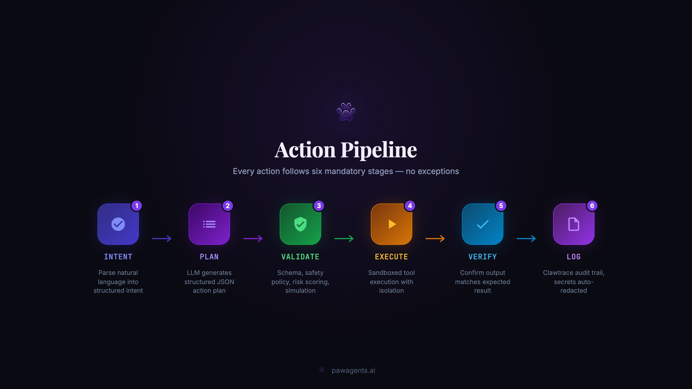
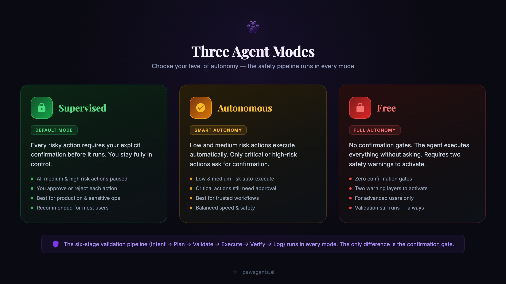

<p align="center">
  
</p>

<h1 align="center">PAW Agents</h1>

<p align="center">
  <strong>Programmable Autonomous Workers</strong><br>
  The operating system for autonomous AI agents.<br>
  Multi-channel · Multi-agent · Safety-first · Extensible
</p>

<p align="center">
  <a href="https://pawagents.ai">&nbsp;<b>Website</b></a>
  &nbsp;&nbsp;&nbsp;·&nbsp;&nbsp;&nbsp;
  <a href="https://x.com/PAWagents">&nbsp;<b>X</b></a>
</p>

<p align="center">
  <a href="https://github.com/DosukaSOL/paw-agents/releases"></a>
  <a href="https://github.com/DosukaSOL/paw-agents/blob/main/LICENSE"></a>
  <a href="https://nodejs.org"></a>
  <a href="https://www.typescriptlang.org"></a>
  <a href="https://x.com/PAWagents"></a>
</p>

<p align="center">
  <a href="#quick-start">Quick Start</a> ·
  <a href="#features">Features</a> ·
  <a href="#channels">Channels</a> ·
  <a href="#agent-modes">Agent Modes</a> ·
  <a href="#intelligence--memory">Intelligence</a> ·
  <a href="#apps--companions">Apps</a> ·
  <a href="#purp-scl">Purp SCL</a> ·
  <a href="#safety">Safety</a> ·
  <a href="#roadmap">Roadmap</a> ·
  <a href="docs/ARCHITECTURE.md">Architecture</a>
</p>

---

## What is PAW?

**PAW Agents** is a production-grade autonomous AI agent framework that converts natural language into safe, validated, traceable actions across **APIs**, **browsers**, **files**, **workflows**, and **external tools**. Multi-channel, multi-model, extensible — with optional blockchain integrations including Solana and [Purp SCL](https://github.com/DosukaSOL/purp-scl).

Every action follows a strict six-stage pipeline:

<p align="center">
  
</p>

```
You : "Send 0.5 SOL to GkXn..."
PAW : ⚠️ Confirmation required — Intent: Transfer 0.5 SOL (risk: 35/100). Reply "yes".
You : "yes"
PAW : ✅ Done — Transfer 0.5 SOL → sig: 4xR7... (2340ms)
```

---

<a id="quick-start"></a>
## Quick Start

```bash
git clone https://github.com/DosukaSOL/paw-agents.git
cd paw-agents
npm install
cp .env.example .env   # Add your API keys and tokens
npm run build
npm start
```

**Requirements:** Node.js 20+ · At least one AI provider (Ollama is free!) · At least one channel token (or use WebChat)

---

<a id="features"></a>
## Features

| Category | Capabilities |
|----------|-------------|
| **Agent Modes** | Supervised / Autonomous / Free — per-user with 2-layer safety gate for Free |
| **Channels** | 20+ channels: Telegram, Discord, Slack, WhatsApp, Email, SMS, WebChat, LINE, Reddit, Matrix, Twitter/X, GitHub, Notion, Calendar, REST API, MQTT, RSS, Voice, Desktop |
| **Models** | OpenAI, Anthropic, Google AI, Mistral, DeepSeek, Groq, **Ollama (FREE)** — automatic failover |
| **Streaming** | Token-by-token streaming from all 7+ providers over WebSocket with sentence buffering for TTS |
| **Voice** | Full voice control: 5 STT + 5 TTS providers, wake words, continuous listening, free local mode (Whisper + Piper) |
| **Daemon** | Always-on 24/7 background service: scheduler, file watchers, clipboard monitor, system tray, notifications |
| **Screen Context** | Active window detection, browser URL capture, activity classification (coding/browsing/writing/etc.) |
| **Live Browser** | Playwright headed browser: click-to-edit overlay, AI-guided automation, persistent sessions, multi-tab |
| **Integrations** | Solana blockchain, APIs, browser automation, file systems, webhooks, MCP tools |
| **Purp SCL** | Optional: v1.1 parser → Anchor Rust codegen → TypeScript SDK + IDL |
| **Multi-Agent** | Registry, capability routing, task delegation |
| **Intelligence** | User profiling, RAG, smart model routing, fast path, conversation branching |
| **Memory** | Persistent vector memory with cosine similarity search |
| **MCP** | Model Context Protocol client for external tool servers |
| **Workflows** | DAG engine: triggers → conditions → actions + reusable templates |
| **Apps** | PAW Hub (Desktop OS), CLI, Electron, React Native mobile, VS Code, browser extension |
| **Tools** | 45+ built-in tools across 13 categories |
| **Safety** | Prompt injection defense, rate limiting, risk scoring, URL sandboxing, tx simulation |
| **Keys** | AES-256-GCM encryption, Ed25519 signing, zeroed after use |
| **Logging** | JSONL audit trail with auto-redacted secrets |
| **Recovery** | Self-healing: diagnose → fix → retry → escalate |
| **Dashboard** | Real-time web UI: chat, status, logs, mode toggle, session persistence |
| **Mission Control** | Real-time agent monitoring, task queues, metrics, alerts, live logs |
| **Hub** | Desktop OS experience — Dashboard + Mission Control + CLI + Plugins + Workflows |
| **Multi-Tenant** | Tenant isolation, per-tenant config, user roles, plan-based limits |
| **Plugins** | Marketplace system with hooks, permissions, activation lifecycle |
| **OAuth2/SSO** | Token-based auth, session management, OAuth2 code flow |
| **Cross-App Sync** | Actions, memory, and conversations sync across ALL channels in real-time |

---

<a id="channels"></a>
## Channels

| Channel | Setup | Protocol |
|---------|-------|----------|
| **Telegram** | `TELEGRAM_BOT_TOKEN` | Telegraf (long polling) |
| **Discord** | `DISCORD_BOT_TOKEN` | discord.js (gateway) |
| **Slack** | `SLACK_BOT_TOKEN` + `SLACK_APP_TOKEN` | Bolt (socket mode) |
| **WhatsApp** | QR code pairing | Baileys (multi-device) |
| **Email** | IMAP/SMTP config | nodemailer + IMAP polling |
| **SMS** | Twilio credentials | Twilio REST API + webhooks |
| **WebChat** | Built-in via Gateway | WebSocket |
| **Webhooks** | `POST /webhook/:id` | HTTP |
| **LINE** | `LINE_CHANNEL_ACCESS_TOKEN` | LINE Messaging API |
| **Reddit** | `REDDIT_CLIENT_ID` + credentials | Reddit API (OAuth2) |
| **Matrix** | `MATRIX_HOMESERVER_URL` + token | Matrix Client-Server API |
| **Twitter/X** | `TWITTER_BEARER_TOKEN` | Twitter API v2 |
| **GitHub** | `GITHUB_TOKEN` + repo | GitHub REST API (polling) |
| **Notion** | `NOTION_TOKEN` + database | Notion API |
| **Calendar** | `GOOGLE_CALENDAR_CREDENTIALS` | Google Calendar API |
| **Desktop** | Built-in | Native OS notifications |
| **REST API** | Built-in on configurable port | HTTP POST endpoint |
| **MQTT** | `MQTT_BROKER_URL` | MQTT protocol (IoT) |
| **RSS** | Feed URLs in config | RSS/Atom polling |
| **Voice** | Microphone + optional API keys | STT → Agent → TTS pipeline |

All channels share the same agent brain, tools, and safety pipeline.

---

<a id="agent-modes"></a>
## Agent Modes

| Mode | Behavior | Confirmation |
|------|----------|--------------|
| **Supervised** | Every action requires explicit user confirmation | Always |
| **Autonomous** | Low/medium risk auto-executes; high risk asks | Smart |
| **Free** | Full autonomy — no confirmation gates | Never |

Free Mode requires passing **two consecutive warning layers** before activation. The full validation pipeline (schema, safety, simulation, logging) runs in **every mode** — only the confirmation gate changes.

<p align="center">
  
</p>

---

## How It Works

```
INTENT → PLAN → VALIDATE → EXECUTE → VERIFY → LOG
```

- **LLM = reasoning only.** Generates structured JSON plans, never executes.
- **System = execution only.** Runs validated plans, never reasons.
- **Everything is logged.** Full audit trail with auto-redacted secrets.
- **Self-healing.** Failures → diagnose → fix → retry → escalate.

---

<a id="purp-scl"></a>
## Purp SCL v1.1 (Optional)

Optional [Purp Smart Contract Language](https://github.com/DosukaSOL/purp-scl) integration for Solana developers — compile, validate, and deploy programs from chat:

```purp
program TokenVault {
}

account VaultState {
  owner: pubkey
  balance: u64
}

instruction Deposit {
  accounts:
    #[mut] vault_state
    #[signer] depositor
  args:
    amount: u64
  body:
    require(amount > 0, InsufficientFunds)
    vault_state.balance += amount
}
```

**Pipeline:** `.purp` source → Parse → Validate → Anchor Rust → TypeScript SDK + IDL

---

## Composable DeFi

Multi-DEX swap routing via Jupiter with strict safety limits:

| Check | Limit |
|-------|-------|
| Max slippage | 5% (hard cap) |
| Max price impact | 10% |
| Max route legs | 5 hops |
| Max swap amount | 100 SOL |
| Min output ratio | 90% |
| Quote expiry | 15 seconds |

Every DeFi operation passes through the full pipeline — quote → simulate → validate → execute → confirm → log.

---

<a id="intelligence--memory"></a>
## Intelligence & Memory

| Feature | Description |
|---------|-------------|
| **User Profiling** | Long-term preference learning per user — task patterns, risk tolerance, topics |
| **RAG** | Index documents, search with TF-IDF embeddings locally — no external API |
| **Smart Routing** | Classify tasks and pick the best model based on performance data |
| **Fast Path** | Simple tasks → fast provider (Groq/Llama) for sub-second responses |
| **Branching** | Branch conversations, explore alternatives, rollback to any point |

---

<a id="safety"></a>
## Safety

| Layer | Protection |
|-------|-----------|
| **Input** | HTML stripping, injection detection (15+ patterns), length limits |
| **Planning** | LLM generates strict JSON only — never executes |
| **Validation** | Schema + logic + safety policy + blockchain simulation |
| **Keys** | AES-256-GCM encrypted at rest, zeroed after use, never logged |
| **Execution** | Sandboxed — file sandbox, HTTPS-only APIs, blocked internal IPs |
| **Blockchain** | Simulation before every tx, risk scoring, confirmation gate (when enabled) |
| **Logging** | All secrets auto-redacted from trace logs |
| **Recovery** | Self-healing: diagnose → fix → retry → escalate |

See [Security Model](docs/SECURITY.md) for the full threat model.

---

<a id="apps--companions"></a>
## Apps & Companions

### CLI
```bash
npx paw chat          # Interactive chat
npx paw status        # System health
npx paw deploy        # Deploy config
npx paw models        # List AI providers
```

### PAW Hub (Desktop OS)
**The Hub is PAW's desktop operating system.** Dashboard + Mission Control + CLI + Plugins + Workflows in one app.
- Startup animation with logo and jingle
- Sidebar navigation between all views
- Real-time sync across all channels
- Action source tracking (see which channel each action came from)
- Plugin toggle, workflow runner, settings panel

### Desktop (Electron)
Native app for macOS, Windows, Linux — system tray, dark theme, WebSocket chat.

### Mobile (React Native)
iOS and Android — real-time chat, auto-reconnect, dark mode.

### VS Code Extension
Sidebar chat panel + right-click "Send to PAW" on code.

### Browser Extension
Chrome/Firefox — popup chat, right-click context menu, floating 🐾 selection button.

### 🐕 Pawl — Desktop Companion

**Pawl** is a cute purple dog that lives on your desktop. Click reactions, notification bubbles, walking, idle animations, sleep mode, sound effects, drag & drop — 25 sprite frames across 5 categories.

```bash
paw companion on          # Enable Pawl
paw companion off         # Disable
paw companion status      # Settings
```

Toggle individual features from the Dashboard sidebar.

---

## Multi-Model Support

| Provider | Models | Free? | Failover |
|----------|--------|-------|----------|
| **Ollama** | Gemma 4, Llama 3, any local model | ✅ FREE | ✅ |
| **OpenAI** | GPT-4o, GPT-4 Turbo | ❌ | ✅ |
| **Anthropic** | Claude Sonnet 4 | ❌ | ✅ |
| **Google AI** | Gemma 3 27B | ❌ | ✅ |
| **Mistral** | Mistral Large | ❌ | ✅ |
| **DeepSeek** | DeepSeek Chat / R1 | ❌ | ✅ |
| **Groq** | Llama 3.3 70B | ❌ | ✅ |

### 🆓 Run AI Agents for FREE with Ollama

**Ollama + Gemma 4** means you can run a full AI agent locally — zero API bills, zero subscriptions.

```bash
# Install Ollama (https://ollama.com)
ollama pull gemma4
# PAW auto-detects your local Ollama instance
npm start
```

Set `OLLAMA_ENABLED=true` and `OLLAMA_MODEL=gemma4` in `.env`. PAW uses Ollama's OpenAI-compatible API at `http://127.0.0.1:11434`.

---

## Gateway & Dashboard

```
http://127.0.0.1:18789     # Dashboard + API
ws://127.0.0.1:18789       # WebSocket
```

| Endpoint | Description |
|----------|------------|
| `/` | Web dashboard (chat, status, logs, mode toggle) |
| `/health` | Health check + uptime |
| `/api/status` | Agent status and mode |
| `/webhook/:id` | Webhook triggers |
| `/api/mission-control` | Mission Control state (agents, tasks, metrics, alerts) |
| `/api/actions` | Action history with source tracking |
| `/api/sync/stats` | Cross-app sync statistics |

---

## Project Structure

```
paw-agents/
├── src/
│   ├── index.ts                    # Entry point
│   ├── agent/                      # Brain (LLM planning) + Loop (orchestrator)
│   ├── core/                       # Types + config
│   ├── models/                     # Multi-model router with failover + streaming
│   ├── gateway/                    # WebSocket gateway + streaming + dashboard server
│   ├── dashboard/                  # Web dashboard SPA
│   ├── browser/                    # Live browser (Playwright) + Click-to-Edit + AI agent
│   ├── voice/                      # STT + TTS + voice agent pipeline
│   ├── daemon/                     # Always-on daemon: scheduler, watchers, notifications, screen context, tray
│   ├── orchestrator/               # Multi-agent coordination
│   ├── vector-memory/              # Persistent vector memory
│   ├── mcp/                        # MCP tool protocol client
│   ├── workflow/                   # DAG workflow engine
│   ├── registry/                   # On-chain agent registry
│   ├── token-gate/                 # SPL token-gated access
│   ├── simulation/                 # Transaction simulation sandbox
│   ├── defi/                       # Composable DeFi execution
│   ├── intelligence/               # Profiler, RAG, fast path, branching
│   ├── integrations/               # 20+ channel adapters + Solana + Purp
│   ├── security/                   # Sanitizer, keystore, rate limiter
│   ├── trace/                      # JSONL audit logger
│   ├── mission-control/            # Real-time monitoring & management
│   ├── plugins/                    # Plugin marketplace system
│   ├── multi-tenant/               # Tenant isolation & management
│   ├── auth/                       # OAuth2 / SSO authentication
│   ├── sync/                       # Cross-app memory & action sync
│   ├── cli/                        # CLI companion
│   └── self-healing/               # Failure recovery
├── desktop/                        # Electron app + Pawl companion
├── mobile/                         # React Native app
├── vscode-extension/               # VS Code extension
├── browser-extension/              # Chrome/Firefox extension
├── skills/examples/                # Skill definitions
├── tests/                          # 102 tests across 20+ suites
└── docs/                           # Architecture, security, spec
```

---

<a id="roadmap"></a>
## Roadmap

### ✅ v3.1 — Channels & Reach
LINE, Reddit, Matrix adapters · Google AI, Mistral, DeepSeek, Groq providers

### ✅ v3.2 — Apps & Companions
Desktop (Electron) · Mobile (React Native) · CLI · VS Code extension · Browser extension · Pawl companion

### ✅ v3.3 — Intelligence & Memory
User profiling · RAG · Smart model routing · Fast path · Conversation branching

### ✅ v3.4 — Platform & Scale
Ollama/Gemma 4 (FREE AI) · PAW Hub desktop OS · Mission Control · Multi-tenant · Plugin marketplace · Workflow templates · OAuth2/SSO · Cross-app sync · Action source tracking · Horizontal scaling types

### ✅ v3.5 — Observability & Hub
Trace Explorer · TraceLogger rewrite · PAW Hub desktop handoff · General-purpose repositioning

### ✅ v3.6 — The OpenClaw Killer
Voice control (5 STT + 5 TTS providers, free local mode) · Always-on daemon (scheduler, watchers, clipboard, tray, notifications) · Live browser with Playwright + click-to-edit overlay + AI-guided automation · Screen & app context awareness · Token-by-token streaming from all providers · 9 new channels (Twitter/X, GitHub, Notion, Calendar, Desktop, REST API, MQTT, RSS, Voice) — **20+ total** · Sentence buffering for voice TTS

### 🔜 v4.0 — Ecosystem
Ethereum/Base/Sui · Purp SCL v2 · Agent marketplace · Analytics dashboard · Public agent directory

---

## Contributing

1. Fork the repo
2. Create a skill in `skills/` following the [spec](docs/SKILL_SPEC.md)
3. Add tests
4. Submit a PR

---

## License

MIT

---

<p align="center">
  <strong>PAW Agents v3.6 — The OpenClaw Killer</strong><br>
  <em>The operating system for autonomous AI agents.</em>
</p>
