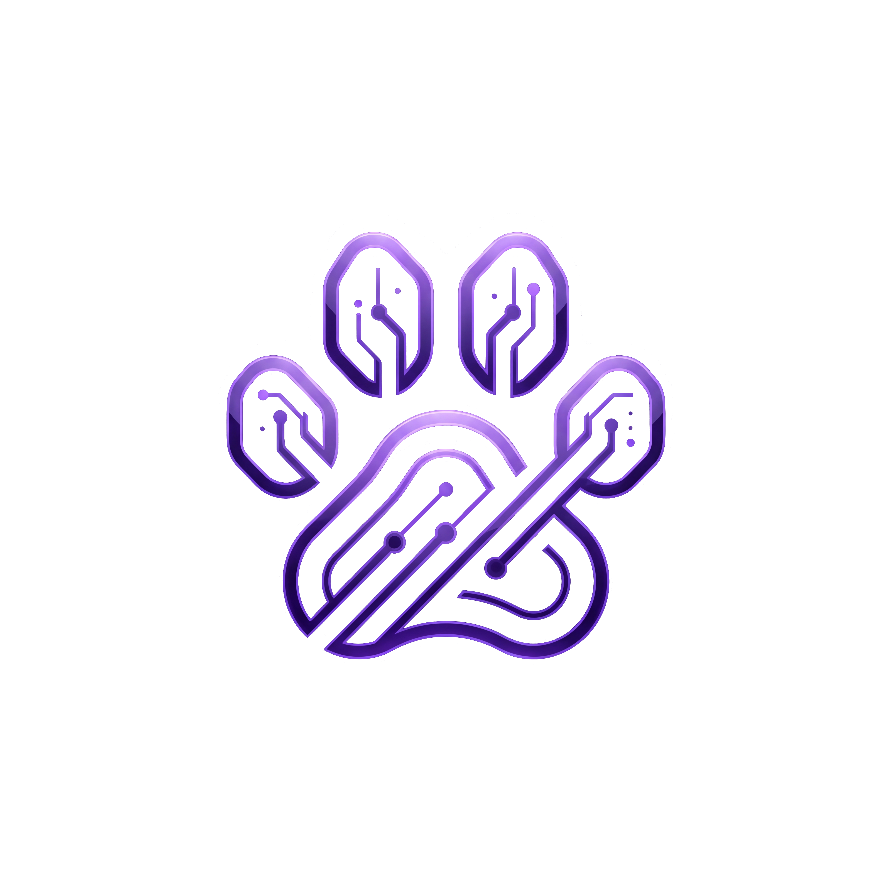

<p align="center">
  
</p>

<h1 align="center">PAW Agents</h1>

<p align="center">
  <strong>Programmable Autonomous Workers</strong><br>
  The operating system for autonomous AI agents.<br>
  Multi-channel · Multi-agent · Safety-first · Extensible
</p>

<p align="center">
  <a href="https://github.com/DosukaSOL/paw-agents/releases"></a>
  <a href="https://github.com/DosukaSOL/paw-agents/blob/main/LICENSE"></a>
  <a href="https://nodejs.org"></a>
  <a href="https://www.typescriptlang.org"></a>
</p>

<p align="center">
  <a href="#quick-start">Quick Start</a> ·
  <a href="#features">Features</a> ·
  <a href="#channels">Channels</a> ·
  <a href="#autonomous-mode">Autonomous Mode</a> ·
  <a href="#purp-scl">Purp SCL</a> ·
  <a href="#safety">Safety</a> ·
  <a href="#roadmap">Roadmap</a> ·
  <a href="docs/ARCHITECTURE.md">Architecture</a>
</p>

<p align="center">
  <a href="https://core.telegram.org/bots/api"></a>
  <a href="https://discord.com/developers/applications"></a>
  <a href="https://api.slack.com/apps"></a>
  <a href="https://developers.facebook.com/docs/whatsapp/cloud-api"></a>
  <a href="https://nodemailer.com/about/"></a>
  <a href="https://www.twilio.com/docs/sms"></a>
  <a href="#channels"></a>
  <a href="#channels"></a>
</p>

---

## What is PAW?

**PAW** stands for **Programmable Autonomous Workers**.

**PAW Agents** is a production-grade autonomous AI agent framework that converts natural language into safe, validated, traceable actions across **APIs**, **browsers**, **files**, **workflows**, **blockchains**, and **external tools**. It comes with native Solana support and the [Purp SCL](https://github.com/DosukaSOL/purp-scl) smart contract language built in.

Every action follows a strict pipeline:

```
INTENT → PLAN → VALIDATE → EXECUTE → VERIFY → LOG
```

Choose your mode:
- 🔒 **Supervised** — Review and confirm all risky actions (default)
- 🤖 **Autonomous** — Agent auto-executes, confirms only critical risks

```
You : "Send 0.5 SOL to GkXn..."
PAW : ⚠️ This action requires confirmation:
      Intent: Transfer 0.5 SOL
      Steps:
        1. Validate recipient address
        2. Check sender balance
        3. Simulate transaction
        4. Execute transfer
      Risk score: 35/100
      Reply "yes" to confirm.
You : "yes"
PAW : ✅ Done: Transfer 0.5 SOL
        ✓ Step 1: Address validated
        ✓ Step 2: Balance sufficient
        ✓ Step 3: Simulation passed
        ✓ Step 4: Transfer complete (sig: 4xR7...)
      ⏱ Completed in 2340ms
```

---

<a id="quick-start"></a>
## Quick Start

```bash
git clone https://github.com/DosukaSOL/paw-agents.git
cd paw-agents
npm install
cp .env.example .env   # Edit with your tokens and API keys
npm run build
npm start
```

### Requirements
- **Node.js 20+**
- At least one AI API key (OpenAI or Anthropic)
- At least one channel token (Telegram, Discord, Slack, or use WebChat)

---

<a id="features"></a>
## Feature Overview

| Category | Capabilities |
|----------|-------------|
| **Agent Modes** | Autonomous / Supervised toggle per user. Validation pipeline configurable. |
| **Channels** | Telegram, Discord, Slack, WhatsApp, Email, SMS, WebChat, Webhooks |
| **Models** | OpenAI (GPT-4o), Anthropic (Claude) with automatic failover |
| **Blockchain** | Native Solana support: transfers, balance checks, SPL tokens, tx simulation |
| **Purp SCL** | v1.1.0 parser, Anchor Rust codegen, TypeScript SDK + IDL generation |
| **Browser** | Puppeteer-based automation: navigate, click, type, extract, screenshot |
| **Multi-Agent** | Agent registry, capability routing, task delegation, multi-step orchestration |
| **Vector Memory** | Persistent semantic memory with cosine similarity search |
| **MCP** | Model Context Protocol client — connect to external MCP tool servers |
| **Workflows** | DAG-based workflow engine: triggers → conditions → actions |
| **On-Chain Registry** | Agent identity verification with PDA-derived keys (Solana) |
| **Token Gate** | SPL token-gated access control with tiered permissions |
| **Tx Simulation** | Full dry-run sandbox with balance change analysis + warning detection |
| **Tools** | 30+ built-in tools: HTTP, file, data, browser, memory, MCP, workflows |
| **Safety** | Prompt injection (15+ patterns), rate limiting, risk scoring, URL sandboxing |
| **Keys** | AES-256-GCM encryption, Ed25519 signing, zeroed after use |
| **Logging** | Clawtrace JSONL audit trail, auto-redacted secrets |
| **Recovery** | Self-healing: diagnose → fix → retry → escalate |
| **Gateway** | WebSocket control plane with auth, health checks, broadcast |
| **Commands** | `/mode`, `/status`, `/skills`, `/config`, `/help`, `/new`, `/version` |
| **Dashboard** | Real-time web dashboard with chat, status cards, action log, mode toggle |
| **Extensibility** | Skill files (`.skill.md`), custom tool registration, MCP servers, plugin-ready |

---

<a id="channels"></a>
## Multi-Channel Support

PAW connects to users wherever they are. Configure one or all:

| | Channel | Setup | Protocol |
|--|---------|-------|----------|
|  | **Telegram** | `TELEGRAM_BOT_TOKEN` | Telegraf (long polling) |
|  | **Discord** | `DISCORD_BOT_TOKEN` | discord.js (gateway) |
|  | **Slack** | `SLACK_BOT_TOKEN` + `SLACK_APP_TOKEN` | Bolt (socket mode) |
|  | **WhatsApp** | QR code pairing | Baileys (multi-device) |
|  | **Email** | IMAP/SMTP config | nodemailer + IMAP polling |
|  | **SMS** | Twilio credentials | Twilio REST API + webhooks |
|  | **WebChat** | Built-in via Gateway | WebSocket |
|  | **Webhooks** | `POST /webhook/:id` | HTTP |

All channels share the same agent brain, tools, and safety pipeline. Channel adapters are loaded dynamically — install only what you need.

---

<a id="autonomous-mode"></a>
## Autonomous Mode

The validation pipeline is **always active** — but the confirmation gate is configurable.

```
/mode autonomous    → Auto-execute, confirm only critical risks
/mode supervised    → Confirm all risky actions (default)
```

### How It Works

| Risk Level | Supervised | Autonomous |
|------------|-----------|------------|
| Low | ✅ Auto | ✅ Auto |
| Medium | ⚠️ Confirm | ✅ Auto |
| High | ⚠️ Confirm | ⚠️ Confirm* |
| Critical | 🛑 Confirm | 🛑 Confirm |

\* High-risk confirmation in autonomous mode is controlled by `CONFIRM_HIGH_RISK=true|false`

**What's always enforced regardless of mode:**
- Schema validation
- Forbidden action blocking
- Transaction simulation
- Prompt injection detection
- Rate limiting
- Full Clawtrace logging

```env
AGENT_MODE=autonomous        # Default mode for new users
REQUIRE_VALIDATION=true      # Can't be turned off — safety always on
CONFIRM_HIGH_RISK=true       # Confirm high-risk even in autonomous mode
```

---

<a id="purp-scl"></a>
## Purp SCL v1.1 Integration

PAW ships with a built-in [Purp Smart Contract Language](https://github.com/DosukaSOL/purp-scl) integration — letting agents compile, validate, and deploy Solana programs without leaving the chat:

### Native `.purp` Syntax

```purp
program TokenVault {
}

account VaultState {
  owner: pubkey
  balance: u64
  is_locked: bool
}

instruction Deposit {
  accounts:
    #[mut] vault_state
    #[signer] depositor
  args:
    amount: u64
  body:
    require(amount > 0, InsufficientFunds)
    vault_state.balance += amount
    emit(DepositMade, { depositor: depositor.key, amount: amount })
}

event DepositMade {
  depositor: pubkey
  amount: u64
}

error VaultErrors {
  InsufficientFunds = "Not enough funds"
  Unauthorized = "Only the owner can do this"
}
```

### Compiler Pipeline

```
.purp source → Parse → Validate → Anchor Rust → TypeScript SDK
```

- **Types**: `u8`–`u128`, `i8`–`i128`, `f32`, `f64`, `bool`, `string`, `pubkey`, `bytes`
- **Blocks**: `program`, `account`, `instruction`, `event`, `error`, `client`, `frontend`
- **v1.1 Syntax**: `pub instruction name(params) { body }` with inline params, `**`, `??`, `...` spread
- **Attributes**: `#[mut]`, `#[signer]`, `#[init]` for account declarations
- **Context Structs**: Auto-generated `<InstructionName>Context` pattern
- **Output**: Anchor-compatible Rust + ready-to-use TypeScript SDK
- **Backward compatible** with legacy JSON Purp format and v0.3 block syntax

### Purp.toml Support

```toml
[package]
name = "my-dapp"
version = "0.1.0"

[dependencies]
spl-token = "0.4"
```

---

## How It Works

```
┌──────────┐   ┌──────────┐   ┌──────────┐   ┌──────────┐   ┌──────────┐   ┌──────────┐
│  INTENT  │ → │   PLAN   │ → │ VALIDATE │ → │ EXECUTE  │ → │  VERIFY  │ → │   LOG    │
│          │   │          │   │          │   │          │   │          │   │          │
│ Sanitize │   │ LLM gen  │   │ Schema   │   │ Tools    │   │ Confirm  │   │ Claw-    │
│ Rate lim │   │ Strict   │   │ Safety   │   │ APIs     │   │ Heal     │   │ trace    │
│ Inject   │   │ JSON     │   │ Simulate │   │ Browser  │   │ Report   │   │ Redact   │
└──────────┘   └──────────┘   └──────────┘   └──────────┘   └──────────┘   └──────────┘
```

### Key Principles
- **LLM = reasoning only.** Generates plans, never executes code.
- **System = execution only.** Runs validated plans, never reasons.
- **Everything is logged.** Full Clawtrace audit trail.
- **Self-healing.** Failures → diagnose → fix → retry → escalate.

---

<a id="safety"></a>
## Safety Guarantees

| Layer | Protection |
|-------|-----------|
| **Input** | HTML stripping, injection detection (15+ patterns), length limits |
| **Planning** | LLM never executes — produces strict JSON only |
| **Validation** | Schema + logic + safety policy + blockchain simulation |
| **Keys** | AES-256-GCM encrypted at rest, zeroed after use, never logged |
| **Execution** | Sandboxed — Purp whitelist, file sandbox, HTTPS-only APIs, blocked internal IPs |
| **Blockchain** | Simulation before every transaction, risk scoring, confirmation gate |
| **Logging** | All secrets auto-redacted from Clawtrace |
| **Recovery** | Self-healing: diagnose → fix → retry → escalate |
| **Rate Limit** | Per-user token bucket with configurable limits |

See [Security Model](docs/SECURITY.md) for the full threat model.

---

## Built-in Tools (30+)

| Tool | Description | Safety |
|------|------------|--------|
| `solana_transfer` | Transfer SOL between wallets | Simulation + confirmation |
| `solana_balance` | Check wallet balance | Read-only |
| `api_call` / `http_get` / `http_post` | Call external APIs | HTTPS-only, no internal IPs |
| `file_read` / `file_write` / `file_list` | File operations | Sandboxed to `data/` directory |
| `data_transform` | JSON, base64, case transforms | Pure functions |
| `data_filter` | Filter arrays by field/value | Pure functions |
| `memory_set` / `memory_get` | Key-value memory store | In-process, scoped |
| `browser_navigate` | Open URL in headless browser | URL sandbox, blocked internals |
| `browser_click` / `browser_type` | Interact with page elements | CSS selector based |
| `browser_extract` | Extract text from page | Read-only |
| `browser_screenshot` | Take full-page screenshot | Base64 encoded |
| `agent_delegate` | Delegate task to specific agent | Capability verified |
| `agent_route` | Auto-route to best agent by intent | Scored matching |
| `vector_store` | Store text with semantic embedding | Persistent, namespace-scoped |
| `vector_search` | Similarity search across memories | Cosine similarity |
| `mcp_connect` | Connect to MCP tool server | URL validated |
| `mcp_invoke` | Call tool on MCP server | Server must be connected |
| `mcp_list_tools` | List all MCP tools | Read-only |
| `workflow_create` | Create DAG workflow | Cycle-validated |
| `workflow_execute` | Execute workflow by ID | Per-step error handling |
| `tx_simulate` | Simulate Solana transaction | Read-only dry run |
| `system_time` | Current UTC time | Read-only |
| `purp_compile` | Compile Purp SCL v1.1 programs | Validated output + IDL |

Register custom tools:
```typescript
agent.registerTool('my_tool', async (params) => {
  return { result: 'done' };
});
```

---

## Chat Commands

Available across all channels:

| Command | Description |
|---------|------------|
| `/start` | Welcome message |
| `/help` | Command reference |
| `/mode [autonomous\|supervised]` | View or switch agent mode |
| `/status` | System health and current settings |
| `/new` / `/reset` | Clear conversation |
| `/skills` | List loaded skills |
| `/config` | View your configuration |
| `/version` | Version info |

---

## WebSocket Gateway + Web Dashboard

Real-time control plane for browser UIs and external integrations. Includes a built-in web dashboard.

```
ws://127.0.0.1:18789        # WebSocket
http://127.0.0.1:18789      # Dashboard
```

### Endpoints

| Endpoint | Method | Description |
|----------|--------|------------|
| `/` | GET | Web dashboard (real-time chat, status, logs) |
| `/health` | GET | Health check + uptime |
| `/api/status` | GET | Agent status, channels, mode |
| `/webhook/:id` | POST | Trigger webhook actions |
| `ws://` | WebSocket | Real-time agent communication |

### Web Dashboard

The built-in dashboard provides:
- **Real-time chat** with the agent via WebSocket
- **Status cards** showing agent status, mode, message count, uptime
- **Action log** with color-coded phases (intake, planning, validation, execution)
- **Mode toggle** buttons for supervised/autonomous switching
- **Auto-reconnect** with periodic health polling

### WebSocket Protocol

```json
// Send a message
{ "type": "message", "channel": "webchat", "from": "user", "payload": "Check my balance" }

// Set mode
{ "type": "command", "payload": { "command": "set_mode", "mode": "autonomous" } }

// Receive response
{ "type": "response", "from": "agent", "payload": { "success": true, "message": "..." } }
```

---

## Skills

Extend PAW with `.skill.md` files:

```yaml
---
metadata:
  name: solana-balance
  version: "1.0.0"
  description: Check SOL balance of any wallet
  category: blockchain

capability:
  purpose: Query Solana wallet balance
  actions: [check_balance, get_balance]

input_schema:
  - name: address
    type: string
    required: true

safety:
  forbidden_actions: [transfer, sign_transaction]
  rate_limit_per_minute: 60
---
```

Skills are validated at startup. Invalid skills are rejected entirely.

See [skills/examples/](skills/examples/) for working examples.

---

## Project Structure

```
paw-agents/
├── src/
│   ├── index.ts                    # Entry point (multi-channel boot)
│   ├── agent/
│   │   ├── brain.ts                # LLM → structured plan
│   │   └── loop.ts                 # Main agent orchestrator
│   ├── core/
│   │   ├── types.ts                # All type definitions
│   │   └── config.ts               # Configuration loader
│   ├── models/
│   │   └── router.ts               # Multi-model with failover
│   ├── gateway/
│   │   └── index.ts                # WebSocket gateway + dashboard
│   ├── dashboard/
│   │   └── index.ts                # Web dashboard SPA (HTML)
│   ├── browser/
│   │   └── index.ts                # Puppeteer browser automation
│   ├── orchestrator/
│   │   └── index.ts                # Multi-agent orchestration
│   ├── vector-memory/
│   │   └── index.ts                # Persistent vector memory
│   ├── mcp/
│   │   └── index.ts                # MCP tool protocol client
│   ├── workflow/
│   │   └── index.ts                # DAG workflow engine
│   ├── registry/
│   │   └── index.ts                # On-chain agent registry
│   ├── token-gate/
│   │   └── index.ts                # SPL token-gated access
│   ├── simulation/
│   │   └── index.ts                # Transaction simulation sandbox
│   ├── commands/
│   │   └── index.ts                # Chat command handler
│   ├── memory/
│   │   └── index.ts                # Multi-scope memory system
│   ├── cron/
│   │   └── index.ts                # Cron scheduler + webhooks
│   ├── skills/
│   │   └── engine.ts               # Skill parser & validator
│   ├── validation/
│   │   └── engine.ts               # Plan validation & safety
│   ├── execution/
│   │   └── engine.ts               # Plan executor + 30+ tools
│   ├── integrations/
│   │   ├── telegram/bot.ts         # Telegram adapter
│   │   ├── discord/adapter.ts      # Discord adapter
│   │   ├── slack/adapter.ts        # Slack adapter
│   │   ├── whatsapp/adapter.ts     # WhatsApp adapter
│   │   ├── webchat/adapter.ts      # WebChat adapter
│   │   ├── email/adapter.ts        # Email adapter (IMAP/SMTP)
│   │   ├── sms/adapter.ts          # SMS adapter (Twilio)
│   │   ├── solana/executor.ts      # Blockchain execution
│   │   └── purp/engine.ts          # Purp SCL v1.1 engine
│   ├── security/
│   │   ├── sanitizer.ts            # Input sanitization
│   │   ├── keystore.ts             # AES-256-GCM keys
│   │   └── rate-limiter.ts         # Rate limiting
│   ├── clawtrace/
│   │   └── index.ts                # JSONL audit logger
│   └── self-healing/
│       └── index.ts                # Failure recovery
├── skills/examples/                # Example skill definitions
├── tests/system.test.ts            # 79 tests across 18 suites
├── docs/                           # Architecture, security, spec
└── .env.example                    # Configuration template
```

---

## Multi-Model Support

| Provider | Models | Failover |
|----------|--------|----------|
| **OpenAI** | GPT-4o, GPT-4 Turbo | ✅ Primary → Anthropic |
| **Anthropic** | Claude Sonnet 4 | ✅ Primary → OpenAI |

```env
DEFAULT_MODEL_PROVIDER=openai
OPENAI_API_KEY=sk-...
ANTHROPIC_API_KEY=sk-ant-...
```

---

## Clawtrace Logging

Every action is logged in structured JSONL with auto-redacted secrets:

```json
{
  "trace_id": "abc-123",
  "session_id": "sess-456",
  "timestamp": "2026-04-06T12:00:00Z",
  "phase": "execution",
  "plan": { "intent": "Transfer 0.5 SOL" },
  "execution": { "success": true, "duration_ms": 1200 },
  "metadata": {}
}
```

---

## Example Workflows

### Check Balance
```
"What's the balance of GkXn5M4qR..."
→ 1 step (read-only) → No confirmation → 12.5 SOL
```

### Transfer SOL
```
"Send 1 SOL to 7Yh2..."
→ 4 steps → ⚠️ Confirmation (risk: 35) → Execute → Done
```

### Deploy Purp Contract
```
"Compile and deploy my token vault"
→ Parse .purp → Validate → Generate Rust + SDK → Deploy → Done
```

### Schedule a Task
```
"Check SOL price every 5 minutes"
→ Cron task created → Runs automatically → Results logged
```

### Autonomous Mode
```
/mode autonomous
"Get the latest SOL price and save to a file"
→ 2 steps (low risk) → Auto-executed → Done in 800ms
```

---

## Why PAW?

| Feature | PAW Agents | Typical Agent Frameworks |
|---------|-----------|-------------------------|
| Validation pipeline | ✅ Always on | ❌ Execute directly |
| Autonomous + Supervised modes | ✅ Per-user toggle | ❌ One mode only |
| Multi-channel | ✅ 8 channels | ⚠️ Usually 1 |
| Browser automation | ✅ Puppeteer | ❌ |
| Multi-agent orchestration | ✅ Registry, routing, delegation | ❌ |
| Vector memory | ✅ Persistent semantic search | ❌ |
| MCP tool protocol | ✅ Client for external servers | ❌ |
| DAG workflows | ✅ Trigger → condition → action | ❌ |
| Blockchain simulation | ✅ Before every tx | ❌ |
| On-chain agent registry | ✅ PDA-derived identity | ❌ |
| Token-gated access | ✅ SPL tiered permissions | ❌ |
| Purp SCL integration | ✅ v1.1 compiler + IDL | ❌ |
| Encrypted key management | ✅ AES-256-GCM | ❌ Plaintext keys |
| Prompt injection defense | ✅ 15+ patterns | ❌ |
| WebSocket gateway + dashboard | ✅ Real-time UI | ❌ |
| Self-healing | ✅ Diagnose → fix → retry | ❌ Basic retry |
| Full audit trail | ✅ Clawtrace | ⚠️ Minimal |
| 79 automated tests | ✅ | ⚠️ Varies |

---

## PAW Agents vs OpenClaw Agents

[OpenClaw](https://github.com/openclaw) is a well-known agent framework. Here's how PAW differentiates — and where it goes further.

### Architecture Philosophy

**OpenClaw** follows a *channel-first* architecture: it connects to 25+ platforms and routes messages to a single execution backend. The LLM can directly trigger actions, and safety is handled through post-hoc guardrails.

**PAW** follows a *safety-first* architecture: every action — without exception — passes through a six-stage pipeline (`INTENT → PLAN → VALIDATE → EXECUTE → VERIFY → LOG`). The LLM only generates structured plans; it never executes anything. This separation is enforced at the type system level, not by convention.

### Head-to-Head Comparison

| Capability | PAW Agents | OpenClaw Agents |
|-----------|-----------|-----------------|
| **Validation pipeline** | ✅ Mandatory 6-stage pipeline, always on | ⚠️ Optional guardrails, can be bypassed |
| **LLM/Execution separation** | ✅ Strict — LLM plans, system executes | ❌ LLM can trigger actions directly |
| **Autonomous mode** | ✅ Per-user toggle with risk-aware gates | ❌ Single execution mode |
| **Blockchain simulation** | ✅ Dedicated simulator with dry-run sandbox | ⚠️ Available but not enforced |
| **Transaction safety** | ✅ Simulate → warn → send pipeline | ❌ Direct send |
| **Prompt injection defense** | ✅ 15+ detection patterns at input layer | ⚠️ Basic filtering |
| **Key management** | ✅ AES-256-GCM encrypted, zeroed after use | ⚠️ Environment variables |
| **Smart contract language** | ✅ Purp SCL v1.1 — `pub instruction`, `#[init]`, SDK + IDL gen | ❌ No integrated SCL |
| **Browser automation** | ✅ Puppeteer — navigate, click, type, extract, screenshot | ✅ Puppeteer/Playwright |
| **Multi-agent orchestration** | ✅ Registry, capability routing, delegation depth 3 | ❌ Single-agent only |
| **Vector memory** | ✅ Persistent TF-IDF semantic search, scoped | ❌ No semantic memory |
| **MCP tool protocol** | ✅ Client — discover & invoke external tool servers | ❌ No MCP support |
| **DAG workflow engine** | ✅ Trigger → condition → action → parallel nodes | ❌ No workflow engine |
| **On-chain agent registry** | ✅ PDA-derived identity, heartbeat, verify | ❌ No on-chain identity |
| **Token-gated access** | ✅ SPL tiered permissions with caching | ❌ No token gating |
| **Web dashboard** | ✅ Real-time SPA — chat, status, action log | ❌ No built-in UI |
| **Audit trail** | ✅ Clawtrace — full JSONL with auto-redaction | ⚠️ Standard logging |
| **Self-healing** | ✅ Diagnose → fix → retry → escalate | ⚠️ Basic retry logic |
| **Risk scoring** | ✅ Per-action score with confirmation gates | ❌ No granular scoring |
| **Channel support** | ✅ 8 channels (Discord, Telegram, Slack, Twitter, WebSocket, Web, Email, SMS) | ✅ 25+ channels |
| **Companion apps** | ❌ Not included | ✅ Mobile + desktop |
| **Built-in tools** | ✅ 30+ tools across 10 categories | ⚠️ ~15 tools |
| **Test coverage** | ✅ 79 tests across 18 suites | ⚠️ Varies by module |

### Where PAW Wins

1. **Safety is non-negotiable.** OpenClaw lets you skip guardrails for speed. PAW doesn't — the validation pipeline runs on every single action, in every mode. You can make it *less intrusive* (autonomous mode), but you can't turn it off.

2. **The LLM never touches execution.** In OpenClaw, the LLM can directly invoke tools and trigger side effects. In PAW, the LLM produces a JSON plan, the system validates it, and only then does execution happen. This eliminates an entire class of prompt injection attacks.

3. **Autonomous doesn't mean unsafe.** PAW's autonomous mode is risk-aware: low and medium risk actions auto-execute, but critical actions always require confirmation. OpenClaw's execution model doesn't distinguish — it's either all-manual or all-automatic.

4. **Purp SCL is a first-class citizen.** PAW can parse `.purp` files, validate them, compile to Anchor Rust, and generate TypeScript SDKs — all within the agent pipeline. OpenClaw has no smart contract language integration.

5. **Every action is traceable.** Clawtrace logs every phase of every action with automatic secret redaction. If something goes wrong six months from now, you can reconstruct exactly what happened, what the LLM reasoned, and why the system made each decision.

6. **Self-healing is intelligent.** When an action fails, PAW doesn't just retry blindly. It diagnoses the failure (network? insufficient funds? permission?), determines if it's recoverable, applies a fix strategy, and only escalates to the user when it genuinely can't recover.

7. **Multi-agent orchestration is built in.** PAW can register, discover, delegate to, and coordinate multiple sub-agents with capability-based routing and depth limits. OpenClaw is single-agent only.

8. **Semantic memory persists across sessions.** Vector memory with TF-IDF scoring, scoped by session/user/global, stored to disk. Agents remember what matters.

9. **DAG workflows with conditions and parallelism.** Define complex multi-step automations with triggers, conditions, transforms, and parallel branches — no external workflow engine needed.

10. **MCP connects to external tool ecosystems.** The MCP client discovers and invokes tools from any Model Context Protocol server, extending PAW's capabilities without writing code.

11. **On-chain identity and token gating.** Agents register via PDA-derived identity on Solana. Access is controlled by SPL token tiers with cached permission checks.

12. **Real-time dashboard out of the box.** A built-in SPA with WebSocket chat, status cards, action log, and mode toggle — no separate UI project needed.

### Where OpenClaw Wins

OpenClaw has broader **channel coverage** (25+ platforms vs PAW's 8) and **companion apps** for mobile and desktop. If you need native mobile/desktop apps or coverage across niche platforms, OpenClaw has that today.

### Bottom Line

OpenClaw connects to more platforms. PAW does **everything else** better.

Safety pipeline that never sleeps. LLM that never touches execution. Browser automation, multi-agent orchestration, semantic memory, DAG workflows, MCP integration, on-chain identity, token-gated access, transaction simulation, a real-time dashboard, and Purp SCL — all built in, all tested (79 tests), all production-ready.

If you want a **framework that maximizes capability, security, and extensibility for autonomous AI agents** — PAW is the clear choice.

---

<a id="roadmap"></a>
## Roadmap

### v3.1 — Channels & Reach
- [ ]  Instagram DM channel adapter
- [ ]  Facebook Messenger channel adapter
- [ ]  LINE channel adapter
- [ ]  WeChat channel adapter
- [ ]  Reddit channel adapter
- [ ]  Matrix / Element channel adapter
- [ ]  Voice channel (Twilio Voice / WebRTC)
- [ ] Custom webhook builder UI in dashboard

### v3.2 — Apps & Companions
- [ ]  PAW Desktop app (Electron — macOS, Windows, Linux)
- [ ]  PAW Mobile app (React Native — iOS, Android)
- [ ]  PAW CLI companion (`paw chat`, `paw deploy`, `paw status`)
- [ ]  VS Code extension — chat with PAW from your editor
- [ ]  Browser extension — trigger PAW from any webpage

### v3.3 — Intelligence & Memory
- [ ] Long-term user profiling with preference learning
- [ ] RAG (Retrieval-Augmented Generation) over user documents
- [ ] Multi-model routing — pick the best model per task automatically
- [ ] Fine-tuned small models for common tasks (low-latency fast path)
- [ ] Conversation branching and rollback

### v3.4 — Platform & Scale
- [ ] Multi-tenant mode — one deployment, many teams
- [ ] Plugin marketplace — discover and install community skills
- [ ] Workflow template library — pre-built automations
- [ ] Horizontal scaling with Redis-backed message queue
- [ ] OAuth2 / SSO authentication for dashboard

### v3.5 — Ecosystem
- [ ] Additional blockchain support (Ethereum, Base, Sui)
- [ ] Purp SCL v2 integration (frontend compilation, multi-file projects)
- [ ] Agent-to-agent marketplace — agents discover and hire each other
- [ ] Analytics dashboard — usage metrics, cost tracking, performance graphs
- [ ] Public agent directory — share your PAW agent configs

### Future
- [ ] On-device inference for privacy-sensitive tasks
- [ ] Formal verification of agent safety properties
- [ ] Visual workflow builder (drag-and-drop)
- [ ] Zapier / Make / n8n integration adapters
- [ ] White-label / embedded mode for SaaS products

Want to contribute to any of these? See [Contributing](#contributing).

---

## Contributing

1. Fork the repo
2. Create a skill in `skills/` following the [spec](docs/SKILL_SPEC.md)
3. Add tests
4. Submit a PR

---

## License

MIT

---

<p align="center">
  <strong>PAW Agents v3.0 — Programmable Autonomous Workers</strong><br>
  <em>The operating system for autonomous AI agents.</em><br><br>
  Ships with native <a href="https://solana.com">Solana</a> support and the <a href="https://github.com/DosukaSOL/purp-scl">Purp SCL</a> smart contract language.
</p>
